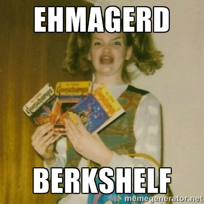
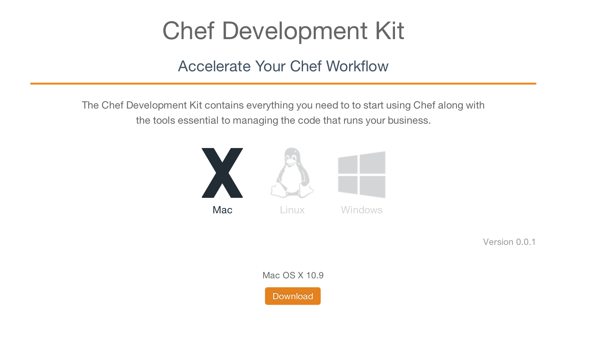
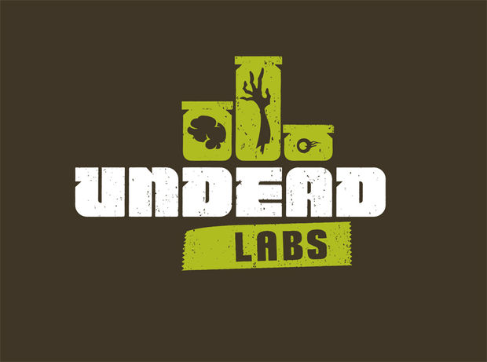
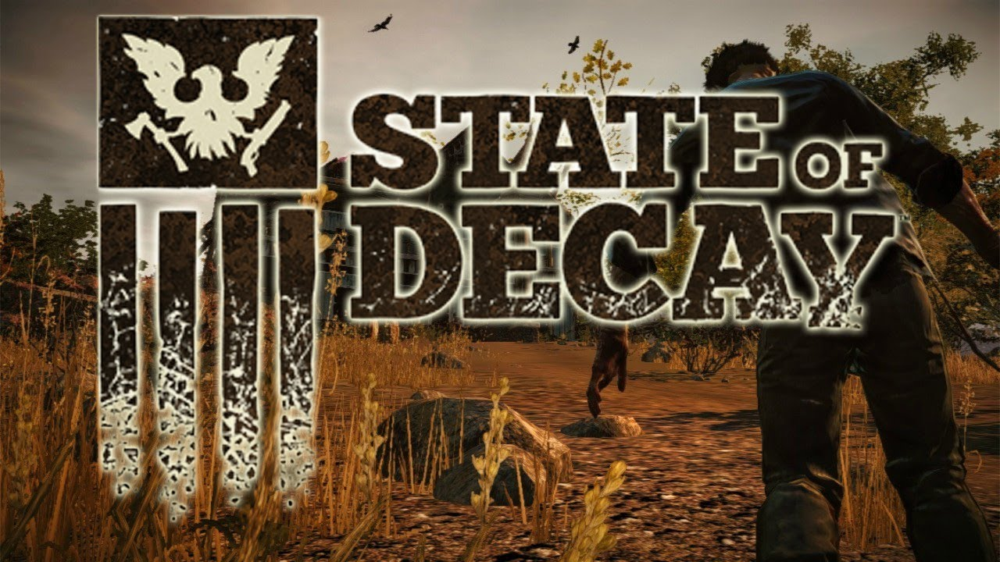
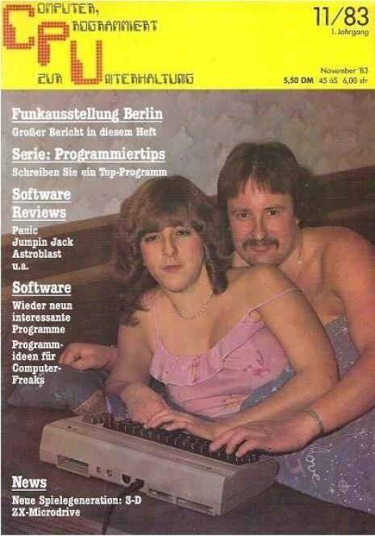
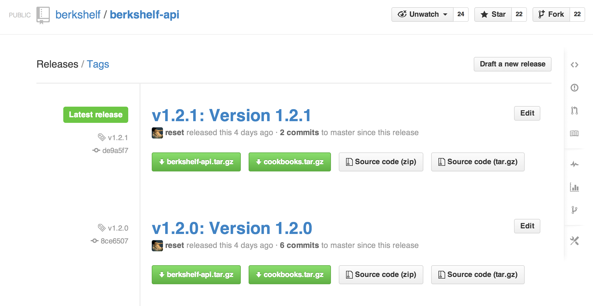
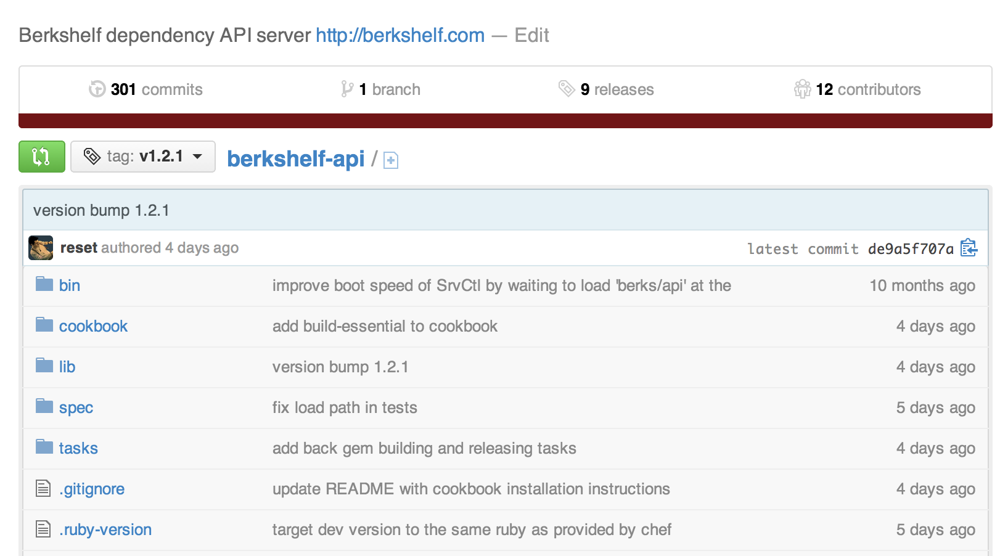
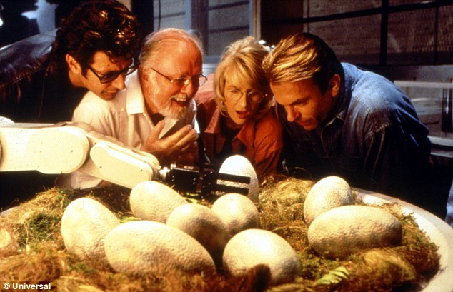
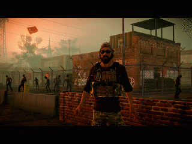

# What do I do with my hands
# And why is my posture so bad
## By Jamie Winsor

^ Big year. Siri still sucks. Lance still isn't a fucking size. Opscode changed their name to Chef making it even more impossible to find resource and provider documentation. And Berkshelf is now stewarted by Chef making it the first community developed and driven tool in the official Chef toolchain. Also, as of Monday...

---

# 3.0 released
## April 13th 2014


^ Berkshelf 3.0 is now *finally* available. Faster resolver (150x?). Consistent results with Chef Server. Faster uploads. Faster downloads. Improved cookbook packaging and more.

---

# berkshelf

Chef Cookbook manager and dependency resolver

* Retrieve a cookbooks dependencies
* Package cookbooks and their dependencies
* Author new cookbooks


^ Upload cookbooks, apply cookbook locks to environments, etc.

---



^ Giving you berks, knife, and other common tools, without needing to maange a Ruby environment

---


^ I'm Jamie Winsor the principle author of Berkshelf, and I'm also the core team lead. Introduce Berkshelf Core team

---

# Berkshelf Core Team

* Jamie Winsor <**jamie@vialstudios.com**>
* Seth Vargo <**sethvargo@gmail.com**>
* Michael Ivey <**michael.ivey@riotgames.com**>


^ In July of last year I made a very hard decision to stop working with some of my best friends on projects that I really believed in to go back to something smaller.

---



^ I work with a bunch of close friends an old co-workers at a video game studio in Seattle, WA called Undead Labs

---



^ We made a single player zombie apocolypse simulator called State of Decay for Xbox 360 and PC that released last year. My primary / secondary responsibilities. The studio is on the smaller scale. We wear many hats.

---

# The Berkshelf Way

* Introduction to Chef Cookbooks
* Introduction to Cookbook Patterns
* Best practices in
  * Cookbook development
  * Cookbook management
* Avoiding pitfalls
* How to iterate quickly

Last year I gave a talk at ChefConf called The Berkshelf Way. The goal of that talk was {bullets}. If you haven't seen the talk go watch it.

---

> Berkshelf doesn't work for my workflow
-- A lot of _smart_ people


---

> Uhhh... yeah it does
-- Me


^ I know the tool and model works fine because we just copied other tools. I filled a hole in the Chef ecosystem that needed to be filled. Just a dependency resolver at heart. How could it not fit in.

---

# Automation is dangerous unless

* It is _portable_
* It is _repeatable_
* It is _predictable_

^ And a dependency resolution tool like Bundler, Rebar, Mix, Leiningen, Maven, or Berkshelf gives you this.

---

### If it's not the tool
### what is it?


^ So if I know it's not the tool.

---

# Software doesn't solve problems. People do.

^ Software is a tool for people to use to solve problems.

---

> If you put the right people in the right room they'll solve the problem the right way
-- Jeff Hackert

^ I took some creative license with his exact words.

---

## Your workflow might need to change


^ If you've been wearing weighted boots and getting your job done. If I give you the ability to fly but you need to take those boots off, you would, right?. If you're developing cookbooks to deploy somebody elses software and you don't sit with that person and the code doesn't live together. That's not DevOps.

---

# DevOps is a software development pattern

^ You can't just rub some DevOps on it.


---

# DevOps is not

* A position
* A team
* A department
* Or an organization

---

> Disruptive startup is hiring DevOps ninjas
-- LinkedIn Spammer


---


---

# Coming Together



^ DevOps is about melding development and operations. Operators become developers and developers become operators.

---

# The Berkshelf Vision


^ There's really one question that I wanted to answer

---

# How do we create a self contained release?

---

# The 3 Requirements For Self Contained Releases

1. Software Artifact (berkshelf-api.tar.gz)
2. Cookbook Artifact (berkshelf-api-cookbooks.tar.gz)
3. Installation | Upgrade | Configuration Docs

^ Even if your organization hasn't fully adopted the DevOps development pattern.

---

# If you're a developer

Give these three things to your Operators for _every release_.


---

# If you're an Operator

You should be receiving these three things for _every release_.


---

# If you're both,

Throw a fucking pizza party


^ Because you did it right.

---

# With those 3 things you can

* Build a _new environment_ with a specific version
* _Upgrade_ pre-existing environments
* Promote through _logical_ environments
  (Dev, Stage, Production)

^ Logical means (dev, stage, prod).

---

# Automation is dangerous unless

* It is _portable_
* It is _repeatable_
* It is _predictable_

^ And if you remember what I said earlier. With these 3 things you have something portable, repeatable, and predictable.

---

# Put those 3 things in an artifact server


---

# Artifact Servers

* Github | Github Enterprise
* Sonatype's Nexus
* Artifactory
* Basic Auth HTTP Server (sadface)
  (https://artifacts.myorg.com/myapp/1.2.3/myapp.tar.gz)


^ There are plenty of artifact servers out there. They're job is to...

---

## Github Releases and Release Assets



^ But I prefer Github / GHE.

---


^ Releases are grouped by version number and assets are attached to each release.

---



---

# Generating your release artifacts



^ How do I generate my release artifacts? If you're not a dev, get involved in this process! If you're a dev, open up for collaboration!

---

# The Software Artifact

1. Bump version
2. Compile w/ dependencies
3. Test
4. Package
    (myapp.tar.gz)


---

# The Cookbook Artifact

Pre-requisites

* Resides in the same repository as your software
* Shares the same version number as your compiled software
* Deploys an archive of the software matching the cookbook's version (by default)
* Follows the Environment Cookbook pattern


^ Cookbook change history is integrated with application code. Developers keep deployment in the front of their mind instead of the back

---

# Environment Cookbook

* Nearly identical to an Application Cookbook
* Has it's Berksfile.lock committed into version control

Generate an environment cookbook with:

```
$ berks cookbook {myapp} --pattern environment
```

^ In December I blogged about this pattern.

---

# How does it work?

The Berksfile.lock is distributed with the cookbook so it can be "applied" to a Chef Environment

```
$ berks apply berks-api-dev -b ~/Downloads/berkshelf-api/Berksfile.lock
```

This sets an equality lock in the Chef Environment (berks-api-dev) for each cookbook in the lockfile

^ This ensures that your environment is exactly as you expected

---

# Berkshelf-API Server Example

* Code in lib/
* Binaries in bin/
* Cookbook in cookbook/
* cookbook/Berksfile.lock present in version control

---

```
$ cat cookbook/metadata.rb
```

```ruby
lib = File.expand_path('../../lib', __FILE__)
$LOAD_PATH.unshift(lib) unless $LOAD_PATH.include?(lib)
require 'berkshelf/api/version'

name             "berkshelf-api"
maintainer       "Jamie Winsor"
maintainer_email "jamie@vialstudios.com"
license          "Apache 2.0"
description      "Installs/Configures a berkshelf-api server"
long_description "Installs/Configures a berkshelf-api server"
version          Berkshelf::API::VERSION
```

^ Let's look at the metadata of the Berkshelf-API server

---

Or with a _VERSION_ file at the root of your application

```
$ cat cookbook/metadata.rb
```

```ruby
name             "some-app"
maintainer       "Jamie Winsor"
maintainer_email "jamie@vialstudios.com"
version          File.read(File.expand_path("../../VERSION", __FILE__))

# ...other metadata...
```

^ Another nice approach is putting a VERSION file at the root of your application and letting your compilation phase pull that in.

---

```
$ cat cookbook/attributes/default.rb
```

```ruby
#
# Cookbook Name:: berkshelf-api
# Attribute:: default
#

default[:berkshelf_api][:release] =
  "v#{Berkshelf::API::Chef.cookbook_version(run_context)}"
```

---

```
$ cat cookbook/libraries/berkshelf_api.rb
```

```ruby
#
# Cookbook Name:: berkshelf-api
# Libraries:: berkshelf_api
#

module Berkshelf
  module API
    module Chef
      class << self
        # Returns the version of the loaded berkshelf-api cookbook
        #
        # @param [Chef::RunContext] context
        #
        # @return [String]
        def cookbook_version(context)
          context.cookbook_collection["berkshelf-api"].version
        end
      end
    end
  end
end
```

---

# Generating the Cookbook artifact

```
$ cd cookbook/
$ berks package
Cookbook(s) packaged to cookbooks-1397345842.tar.gz
```

## The archive contains

* The Berksfile.lock from resolution
* A cookbooks directory containing each cookbook found in the Berksfile.lock

^ The resulting tar is perfect for passing to Chef-Solo if that's your thing.

---

# How do I get the artifacts into a Github release?

* Octokit & Rake/Thor
* Create a release manually and attach the asset
  (boo.)


^ Octokit is a Ruby gem for interacting with the Github API. Mention the Berkflow tasks.

---

# How do I get the artifacts out?


^ So if I have the artifacts in Github, how do we get them out on a node? This is a bit more complicated becuase it involves the cookbook recipe and not just a build script.

---

# Github Cookbook

Provides an LWRP for downloading

* An asset from a Github release
* An archive containing source code from a tag, branch, or revision

# Libarchive Cookbook

Provides an LWRP for idempotently extracting archives

---

```
$ cat cookbook/metadata.rb
```

```ruby
name             "berkshelf-api"
maintainer       "Jamie Winsor"
maintainer_email "jamie@vialstudios.com"

# ... other metadata ...

depends "github"
depends "libarchive"
depends "build-essential", "~> 2.0"
```

^ Add these to your metadata along with build-essential

---

```
$ cat cookbook/recipes/app.rb
```

```ruby

node.set[:'build-essential'][:compile_time] = true
include_recipe "build-essential::default"

asset = github_asset "berkshelf-api.tar.gz" do
  repo "berkshelf/berkshelf-api"
  release "v1.2.1"
end

libarchive_file "berkshelf-api.tar.gz" do
  path asset.asset_path
  extract_to "/opt/berkshelf-api/v1.2.1"
  owner "berkshelf"
  group "berkshelf"

  action :extract
  notifies :restart, "runit_service[berks-api]"
  only_if { ::File.exist?(asset.asset_path) }
end

```

^ Make sure you include build-essential and set the compile_time flag. This is required for the libarchive_file resource. These two definitions are a great place to start and often all you need.

---

# The Story So Far

* We have an encapsulated release containing
  * A software artifact
  * A cookbook artifact
  * And you wrote and committed a README containing installation/configuration instructions
* It's located on an artifact server
* _Bonus round:_ The release is also tied to the version control ref it was built from

^ Not we have to get this to somebody

---

# Solving Distribution


^ Now you could give the release link to a co-worker or maybe your build process already uploaded the cookbooks into your chef server. But let's do this in style.

---

# Berkflow
## A Cookbook-Centric Deployment workflow tool


^ I recently open sourced a small tool called Berkflow. It's still early on and depending on how things go with ChefDK it might not have a long life. It exists to illustrate a world we could have.

---

# Install Berkflow with Chef-DK

```
$ sudo chef gem install berkflow
$ export PATH=/opt/chefdk/embedded/bin:$PATH
```

```
$ which blo
/opt/chefdk/embedded/bin/blo
```

Install with sudo for now:
(https://github.com/opscode/chef-dk/issues/11)

^ Assuming we have the ChefDK installed

---

# "Install" the cookbook artifact into your Chef Server

```
$ blo install https://github.com/berkshelf/berkshelf-api/releases/download/v1.2.1/cookbooks.tar.gz
```

^ This can also be accomplished by just downloading the archive and uploading each cookbook with Knife. Like I mentioned this is about UX.

---

# "Upgrading" a Chef Environment

```
$ blo upgrade berks-api-dev berkshelf-api 1.2.1
```

Or upgrade to latest

```
$ blo upgrade berks-api-dev berkshelf-api latest
```

---

# One Button Upgrade



^ If you aren't upgrading but starting fresh. Use knife to create an environment and bootstrap nodes into it with an empty run list. Then use knife to add the recipe to the run list before running upgrade.

---

# Wanna Make Games?

_http://undeadlabs.com/jobs/_

* Game Programmer
* Game Producer
* Game Animator
* Game Designer

---

# External Resources

* http://berkshelf.com
* http://getchef.com/downloads/chef-dk
* https://github.com/berkshelf/berkshelf
* https://github.com/berkshelf/berkshelf-api
* https://github.com/reset/berkflow
* https://github.com/reset/libarchive-cookbook
* https://github.com/reset/github-cookbook

---

# Jamie Winsor
## @resetexistence
## github.com/reset


